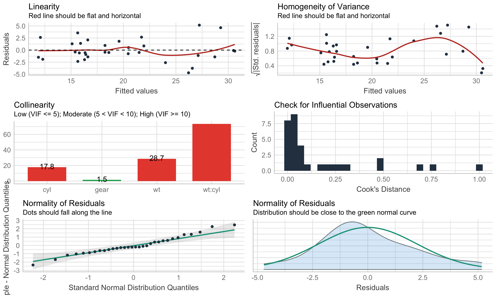

# performance 

[](https://cran.r-project.org/package=performance)
[](https://cran.r-project.org/package=performance)

***Test if your model is a good model\!***

The primary goal of the **performance** package is to provide utilities
for computing **indices of model quality** and **goodness of fit**. This
includes measures like r-squared (R2), root mean squared error (RMSE) or
intraclass correlation coefficient (ICC) , but also functions to check
(mixed) models for overdispersion, zero-inflation, convergence or
singularity.

## Installation

Run the following:

``` r
install.packages("performance")
```

``` r
library("performance")
```

# Examples

[](https://easystats.github.io/performance/)
[](https://easystats.github.io/performance/reference/index.html)
[](https://easystats.github.io/blog/posts/)

There is a nice introduction into the package on
[youtube](https://www.youtube.com/watch?v=EPIxQ5i5oxs).

## Assessing model quality

### R-squared

**performance** has a generic `r2()` function, which computes the
r-squared for many different models, including mixed effects and
Bayesian regression models.

`r2()` returns a list containing values related to the “most
appropriate” r-squared for the given model.

``` r
model <- lm(mpg ~ wt + cyl, data = mtcars)
r2(model)
#> # R2 for Linear Regression
#> 
#>        R2: 0.830
#>   adj. R2: 0.819

model <- glm(am ~ wt + cyl, data = mtcars, family = binomial)
r2(model)
#> $R2_Tjur
#> Tjur's R2 
#>    0.7051

library(MASS)
data(housing)
model <- polr(Sat ~ Infl + Type + Cont, weights = Freq, data = housing)
r2(model)
#> $R2_Nagelkerke
#> Nagelkerke's R2 
#>          0.1084
```

The different R-squared measures can also be accessed directly via
functions like `r2_bayes()`, `r2_coxsnell()` or `r2_nagelkerke()` (see a
full list of functions
[here](https://easystats.github.io/performance/reference/index.html)).

For mixed models, the *conditional* and *marginal* R-squared are
returned. The *marginal R-squared* considers only the variance of the
fixed effects and indicates how much of the model’s variance is
explained by the fixed effects part only. The *conditional R-squared*
takes both the fixed and random effects into account and indicates how
much of the model’s variance is explained by the “complete” model.

For frequentist mixed models, `r2()` (resp. `r2_nakagawa()`) computes
the *mean* random effect variances, thus `r2()` is also appropriate for
mixed models with more complex random effects structures, like random
slopes or nested random effects (Johnson 2014; Nakagawa, Johnson, and
Schielzeth 2017).

``` r
library(rstanarm)
model <- stan_glmer(Petal.Length ~ Petal.Width + (1 | Species), data = iris, cores = 4)
r2(model)
#> # Bayesian R2 with Standard Error
#> 
#>   Conditional R2: 0.953 (89% CI [0.944, 0.962])
#>      Marginal R2: 0.823 (89% CI [0.740, 0.885])

library(lme4)
model <- lmer(Reaction ~ Days + (1 + Days | Subject), data = sleepstudy)
r2(model)
#> # R2 for Mixed Models
#> 
#>   Conditional R2: 0.799
#>      Marginal R2: 0.279
```

### Intraclass Correlation Coefficient (ICC)

Similar to R-squared, the ICC provides information on the explained
variance and can be interpreted as “the proportion of the variance
explained by the grouping structure in the population” (Hox 2010).

`icc()` calculates the ICC for various mixed model objects, including
`stanreg` models…

``` r
library(lme4)
model <- lmer(Reaction ~ Days + (1 + Days | Subject), data = sleepstudy)
icc(model)
#> # Intraclass Correlation Coefficient
#> 
#>      Adjusted ICC: 0.722
#>   Conditional ICC: 0.521
```

…and models of class `brmsfit`.

``` r
library(brms)
set.seed(123)
model <- brm(mpg ~ wt + (1 | cyl) + (1 + wt | gear), data = mtcars)
```

``` r
icc(model)
#> # Intraclass Correlation Coefficient
#> 
#>      Adjusted ICC: 0.930
#>   Conditional ICC: 0.771
```

## Model diagnostics

### Check for overdispersion

Overdispersion occurs when the observed variance in the data is higher
than the expected variance from the model assumption (for Poisson,
variance roughly equals the mean of an outcome).
`check_overdispersion()` checks if a count model (including mixed
models) is overdispersed or not.

``` r
library(glmmTMB)
data(Salamanders)
model <- glm(count ~ spp + mined, family = poisson, data = Salamanders)
check_overdispersion(model)
#> # Overdispersion test
#> 
#>        dispersion ratio =    2.946
#>   Pearson's Chi-Squared = 1873.710
#>                 p-value =  < 0.001
#> Overdispersion detected.
```

Overdispersion can be fixed by either modelling the dispersion parameter
(not possible with all packages), or by choosing a different
distributional family \[like Quasi-Poisson, or negative binomial, see
(Gelman and Hill 2007).

### Check for zero-inflation

Zero-inflation (in (Quasi-)Poisson models) is indicated when the amount
of observed zeros is larger than the amount of predicted zeros, so the
model is *underfitting* zeros. In such cases, it is recommended to use
negative binomial or zero-inflated models.

Use `check_zeroinflation()` to check if zero-inflation is present in the
fitted model.

``` r
model <- glm(count ~ spp + mined, family = poisson, data = Salamanders)
check_zeroinflation(model)
#> # Check for zero-inflation
#> 
#>    Observed zeros: 387
#>   Predicted zeros: 298
#>             Ratio: 0.77
#> Model is underfitting zeros (probable zero-inflation).
```

### Check for singular model fits

A “singular” model fit means that some dimensions of the
variance-covariance matrix have been estimated as exactly zero. This
often occurs for mixed models with overly complex random effects
structures.

`check_singularity()` checks mixed models (of class `lme`, `merMod`,
`glmmTMB` or `MixMod`) for singularity, and returns `TRUE` if the model
fit is singular.

``` r
library(lme4)
data(sleepstudy)

# prepare data
set.seed(123)
sleepstudy$mygrp <- sample(1:5, size = 180, replace = TRUE)
sleepstudy$mysubgrp <- NA
for (i in 1:5) {
    filter_group <- sleepstudy$mygrp == i
    sleepstudy$mysubgrp[filter_group] <- sample(1:30, size = sum(filter_group), replace = TRUE)
}

# fit strange model
model <- lmer(Reaction ~ Days + (1 | mygrp/mysubgrp) + (1 | Subject), data = sleepstudy)

check_singularity(model)
#> [1] TRUE
```

Remedies to cure issues with singular fits can be found
[here](https://easystats.github.io/performance/reference/check_singularity.html).

### Comprehensive visualization of model checks

**performance** provides many functions to check model assumptions, like
`check_collinearity()`, `check_normality()` or
`check_heteroscedasticity()`. To get a comprehensive check, use
`check_model()`.

``` r
model <- lm(mpg ~ wt * cyl + gear, data = mtcars)
check_model(model)
```

<!-- -->

## Model performance summaries

`model_performance()` computes indices of model performance for
regression models. Depending on the model object, typical indices might
be r-squared, AIC, BIC, RMSE, ICC or LOOIC.

### Linear model

``` r
m1 <- lm(mpg ~ wt + cyl, data = mtcars)
model_performance(m1)
#> # Indices of model performance
#> 
#> AIC    |    BIC |   R2 | R2 (adj.) | RMSE | Sigma
#> -------------------------------------------------
#> 156.01 | 161.87 | 0.83 |      0.82 | 2.44 |  2.57
```

### Logistic regression

``` r
m2 <- glm(vs ~ wt + mpg, data = mtcars, family = "binomial")
model_performance(m2)
#> # Indices of model performance
#> 
#> AIC   |   BIC | Tjur's R2 | RMSE | Sigma | Log_loss | Score_log | Score_spherical |  PCP
#> ----------------------------------------------------------------------------------------
#> 31.30 | 35.70 |      0.48 | 0.36 |  0.93 |     0.40 |    -14.90 |            0.09 | 0.74
```

### Linear mixed model

``` r
library(lme4)
m3 <- lmer(Reaction ~ Days + (1 + Days | Subject), data = sleepstudy)
model_performance(m3)
#> # Indices of model performance
#> 
#> AIC     |     BIC | R2 (cond.) | R2 (marg.) |  ICC |  RMSE | Sigma
#> ------------------------------------------------------------------
#> 1755.63 | 1774.79 |       0.80 |       0.28 | 0.72 | 23.44 | 25.59
```

## Models comparison

The `compare_performance()` function can be used to compare the
performance and quality of several models (including models of different
types).

``` r
counts <- c(18, 17, 15, 20, 10, 20, 25, 13, 12)
outcome <- gl(3, 1, 9)
treatment <- gl(3, 3)
m4 <- glm(counts ~ outcome + treatment, family = poisson())

compare_performance(m1, m2, m3, m4)
#> # Comparison of Model Performance Indices
#> 
#> Model |    Type |     AIC |     BIC |  RMSE | Sigma | Score_log | Score_spherical |   R2 | R2 (adj.) | Tjur's R2 | Log_loss |  PCP | R2 (cond.) | R2 (marg.) |  ICC | Nagelkerke's R2
#> -------------------------------------------------------------------------------------------------------------------------------------------------------------------------------------
#> m1    |      lm |  156.01 |  161.87 |  2.44 |  2.57 |           |                 | 0.83 |      0.82 |           |          |      |            |            |      |                
#> m2    |     glm |   31.30 |   35.70 |  0.36 |  0.93 |    -14.90 |            0.09 |      |           |      0.48 |     0.40 | 0.74 |            |            |      |                
#> m3    | lmerMod | 1755.63 | 1774.79 | 23.44 | 25.59 |           |                 |      |           |           |          |      |       0.80 |       0.28 | 0.72 |                
#> m4    |     glm |   56.76 |   57.75 |  3.04 |  1.13 |     -2.60 |            0.32 |      |           |           |          |      |            |            |      |            0.66
```

### General index of model performance

One can also easily compute and a [**composite
index**](https://easystats.github.io/performance/reference/compare_performance.html#details)
of model performance and sort the models from the best one to the worse.

``` r
compare_performance(m1, m2, m3, m4, rank = TRUE)
#> # Comparison of Model Performance Indices
#> 
#> Model |    Type |     AIC |     BIC |  RMSE | Sigma | Performance-Score
#> -----------------------------------------------------------------------
#> m2    |     glm |   31.30 |   35.70 |  0.36 |  0.93 |           100.00%
#> m4    |     glm |   56.76 |   57.75 |  3.04 |  1.13 |            96.21%
#> m1    |      lm |  156.01 |  161.87 |  2.44 |  2.57 |            92.46%
#> m3    | lmerMod | 1755.63 | 1774.79 | 23.44 | 25.59 |             0.00%
```

### Visualisation of indices of models’ performance

Finally, we provide convenient visualisation (the `see` package must be
installed).

``` r
plot(compare_performance(m1, m2, m4, rank = TRUE))
```

<!-- -->

### Comparing models with the Bayes Factor

For some models (for instance, frequentist linear models), the
`compare_performance()` function will compute the **Bayes factor (BF)**,
testing if each model is better than the first one (which is used as a
ground reference).

``` r
m1 <- lm(Sepal.Length ~ Petal.Length, data = iris)
m2 <- lm(Sepal.Length ~ Petal.Length + Petal.Width, data = iris)
m3 <- lm(Sepal.Length ~ Petal.Length * Petal.Width, data = iris)

compare_performance(m1, m2, m3)
#> # Comparison of Model Performance Indices
#> 
#> Model | Type |    AIC |    BIC |   R2 | R2 (adj.) | RMSE | Sigma |     BF
#> -------------------------------------------------------------------------
#> m1    |   lm | 160.04 | 169.07 | 0.76 |      0.76 | 0.40 |  0.41 |   1.00
#> m2    |   lm | 158.05 | 170.09 | 0.77 |      0.76 | 0.40 |  0.40 |  0.601
#> m3    |   lm | 130.70 | 145.75 | 0.81 |      0.80 | 0.36 |  0.37 | > 1000
```

# References

<div id="refs" class="references hanging-indent">

<div id="ref-gelman_data_2007">

Gelman, Andrew, and Jennifer Hill. 2007. *Data Analysis Using Regression
and Multilevel/Hierarchical Models*. Analytical Methods for Social
Research. Cambridge ; New York: Cambridge University Press.

</div>

<div id="ref-hox_multilevel_2010">

Hox, J. J. 2010. *Multilevel Analysis: Techniques and Applications*. 2nd
ed. Quantitative Methodology Series. New York: Routledge.

</div>

<div id="ref-johnson_extension_2014">

Johnson, Paul C. D. 2014. “Extension of Nakagawa & Schielzeth’s R2 GLMM
to Random Slopes Models.” Edited by Robert B. O’Hara. *Methods in
Ecology and Evolution* 5 (9): 944–46.
<https://doi.org/10.1111/2041-210X.12225>.

</div>

<div id="ref-nakagawa_coefficient_2017">

Nakagawa, Shinichi, Paul C. D. Johnson, and Holger Schielzeth. 2017.
“The Coefficient of Determination R2 and Intra-Class Correlation
Coefficient from Generalized Linear Mixed-Effects Models Revisited and
Expanded.” *Journal of the Royal Society Interface* 14 (134): 20170213.
<https://doi.org/10.1098/rsif.2017.0213>.

</div>

</div>
