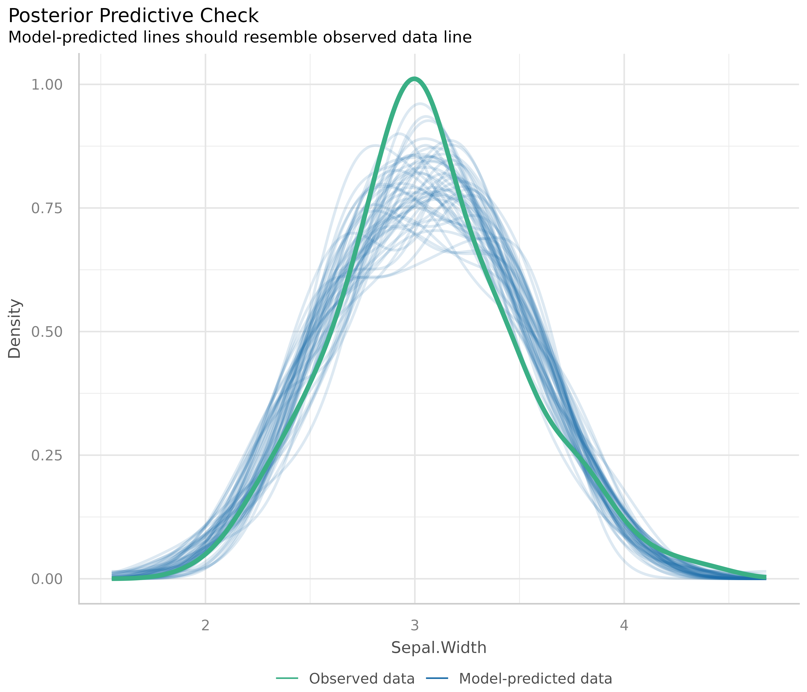
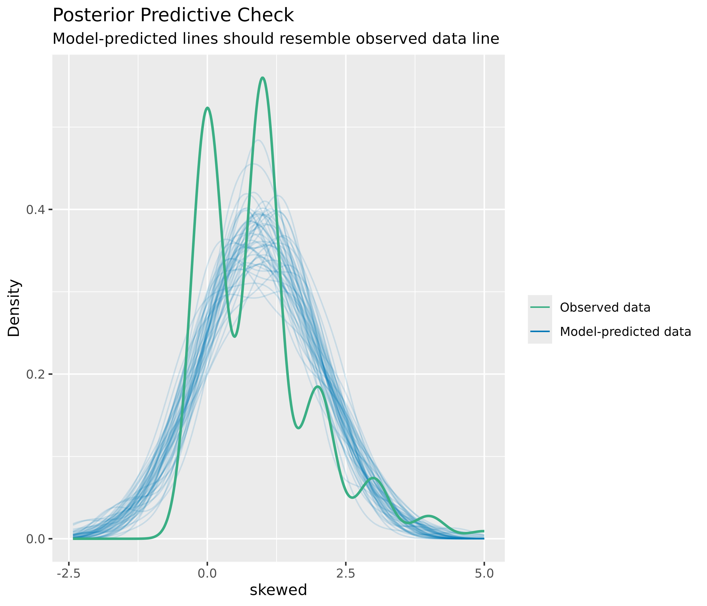
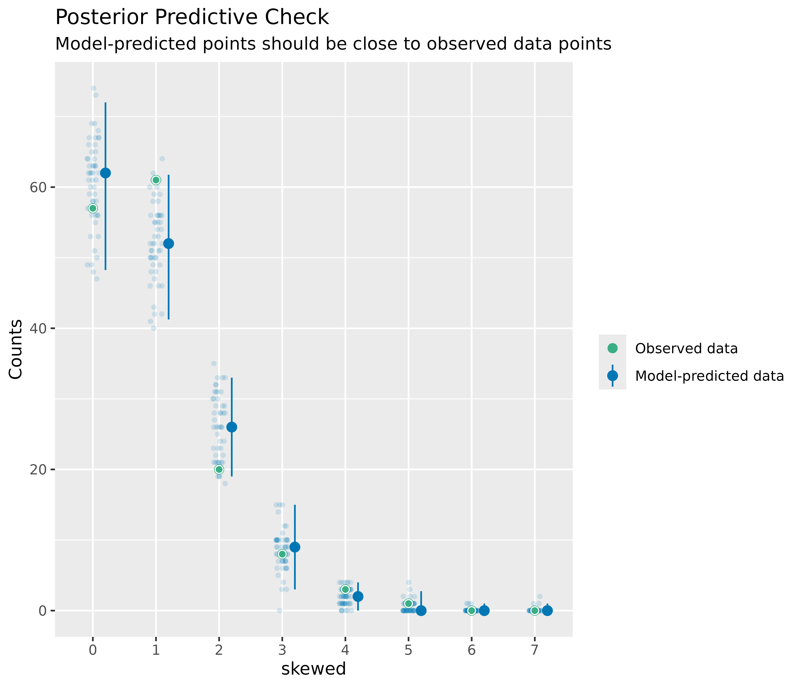
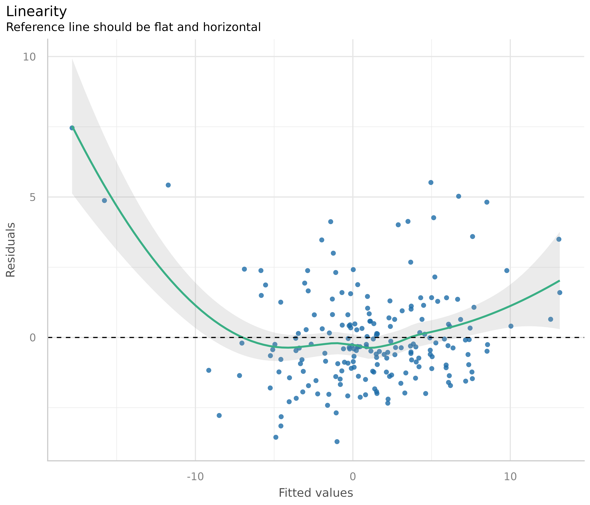
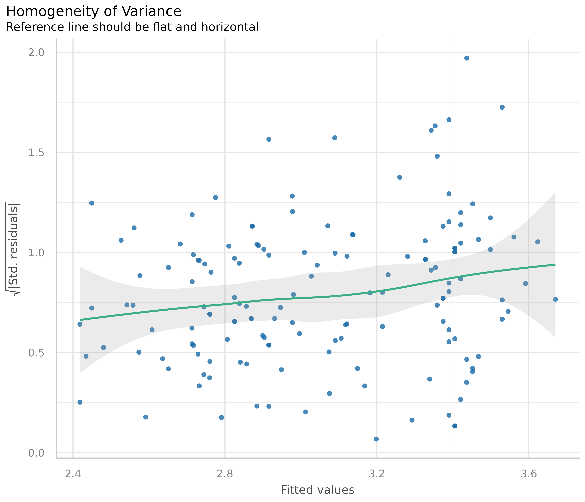
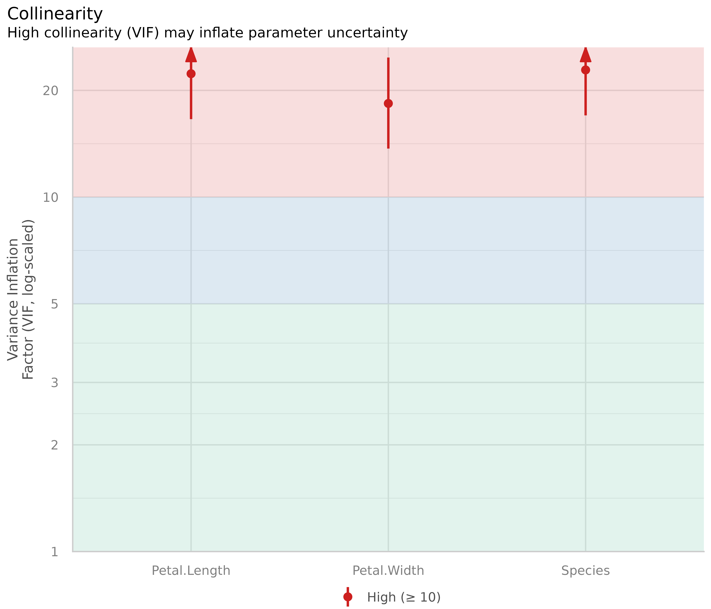
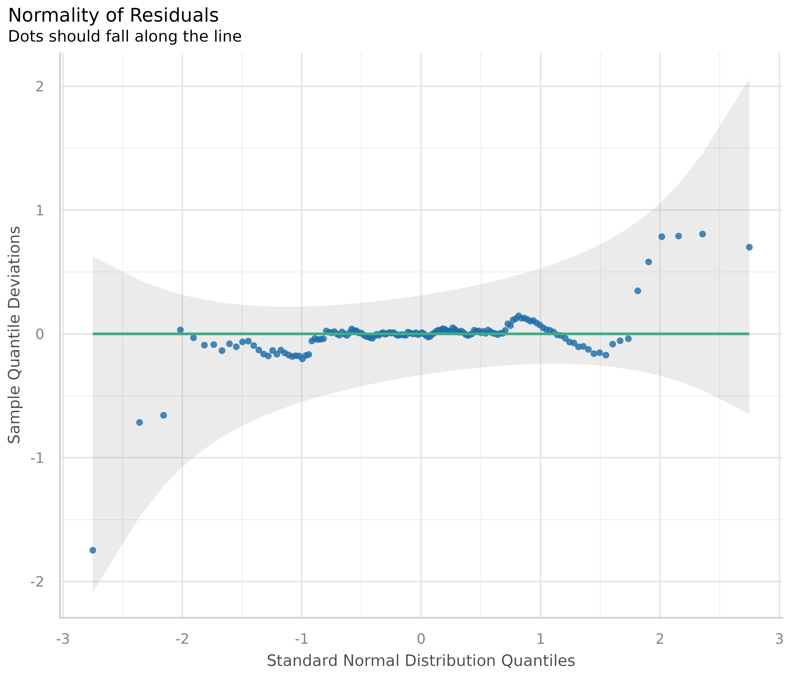

# Checking model assumption - linear models

## Make sure your model inference is accurate!

Model diagnostics is crucial, because parameter estimation, p-values and
confidence interval depend on correct model assumptions as well as on
the data. If model assumptions are violated, estimates can be
statistically significant “even if the effect under study is null”
(*Gelman/Greenland 2019*).

There are several problems associated with model diagnostics. Different
types of models require different checks. For instance, normally
distributed residuals are assumed to apply for linear regression, but is
no appropriate assumption for logistic regression. Furthermore, it is
recommended to carry out visual inspections, i.e. to generate and
inspect so called diagnostic plots of model assumptions - formal
statistical tests are often too strict and warn of violation of the
model assumptions, although everything is fine within a certain
tolerance range. But how should such diagnostic plots be interpreted?
And if violations have been detected, how to fix them?

This vignette introduces the
[`check_model()`](https://easystats.github.io/performance/reference/check_model.md)
function of the **performance** package, shows how to use this function
for different types of models and how the resulting diagnostic plots
should be interpreted. Furthermore, recommendations are given how to
address possible violations of model assumptions.

Most plots seen here can also be generated by their dedicated functions,
e.g.:

- Posterior predictive checks:
  [`check_predictions()`](https://easystats.github.io/performance/reference/check_predictions.md)
- Homogeneity of variance:
  [`check_heteroskedasticity()`](https://easystats.github.io/performance/reference/check_heteroscedasticity.md)
- Normality of residuals:
  [`check_normality()`](https://easystats.github.io/performance/reference/check_normality.md)
- Multicollinearity:
  [`check_collinearity()`](https://easystats.github.io/performance/reference/check_collinearity.md)
- Influential observations:
  [`check_outliers()`](https://easystats.github.io/performance/reference/check_outliers.md)
- Binned residuals:
  [`binned_residuals()`](https://easystats.github.io/performance/reference/binned_residuals.md)
- Check for overdispersion:
  [`check_overdispersion()`](https://easystats.github.io/performance/reference/check_overdispersion.md)

## Linear models: Are all assumptions for linear models met?

We start with a simple example for a linear model.

``` r

data(iris)
m1 <- lm(Sepal.Width ~ Species + Petal.Length + Petal.Width, data = iris)
```

Before we go into details of the diagnostic plots, let’s first look at
the summary table.

``` r

library(parameters)
model_parameters(m1)
#> Parameter            | Coefficient |   SE |         95% CI | t(145) |      p
#> ----------------------------------------------------------------------------
#> (Intercept)          |        3.05 | 0.09 | [ 2.86,  3.23] |  32.52 | < .001
#> Species [versicolor] |       -1.76 | 0.18 | [-2.12, -1.41] |  -9.83 | < .001
#> Species [virginica]  |       -2.20 | 0.27 | [-2.72, -1.67] |  -8.28 | < .001
#> Petal Length         |        0.15 | 0.06 | [ 0.03,  0.28] |   2.38 | 0.018 
#> Petal Width          |        0.62 | 0.14 | [ 0.35,  0.89] |   4.57 | < .001
```

There is nothing suspicious so far. Now let’s start with model
diagnostics. We use the
[`check_model()`](https://easystats.github.io/performance/reference/check_model.md)
function, which provides an overview with the most important and
appropriate diagnostic plots for the model under investigation.

``` r

library(performance)
check_model(m1)
```


Now let’s take a closer look for each plot. To do so, we ask
[`check_model()`](https://easystats.github.io/performance/reference/check_model.md)
to return a single plot for each check, instead of arranging them in a
grid. We can do so using the `panel` argument. This returns a list of
*ggplot* plots.

``` r

# return a list of single plots
diagnostic_plots <- plot(check_model(m1, panel = FALSE))
```

### Posterior predictive checks

The first plot is based on
[`check_predictions()`](https://easystats.github.io/performance/reference/check_predictions.md).
Posterior predictive checks can be used to “look for systematic
discrepancies between real and simulated data” (*Gelman et al. 2014,
p. 169*). It helps to see whether the type of model (distributional
family) fits well to the data (*Gelman and Hill, 2007, p. 158*).

``` r

# posterior predicive checks
diagnostic_plots[[1]]
```



The blue lines are simulated data based on the model, if the model were
true and distributional assumptions met. The green line represents the
actual observed data of the response variable.

This plot looks good, and thus we would not assume any violations of
model assumptions here.

Next, a different example. We use a Poisson-distributed outcome for our
linear model, so we should expect some deviation from the distributional
assumption of a linear model.

``` r

set.seed(99)
d <- iris
d$skewed <- rpois(150, 1)
m2 <- lm(skewed ~ Species + Petal.Length + Petal.Width, data = d)
out <- check_predictions(m2)
plot(out)
```



As you can see, the green line in this plot deviates visibly from the
blue lines. This may indicate that our linear model is not appropriate,
since it does not capture the distributional nature of the response
variable properly.

#### How to fix this?

The best way, if there are serious concerns that the model does not fit
well to the data, is to use a different type (family) of regression
models. In our example, it is obvious that we should better use a
Poisson regression.

#### Plots for discrete outcomes

For discrete or integer outcomes (like in logistic or Poisson
regression), density plots are not always the best choice, as they look
somewhat “wiggly” around the actual values of the dependent variables.
In this case, use the `type` argument of the
[`plot()`](https://rdrr.io/r/graphics/plot.default.html) method to
change the plot-style. Available options are `type = "discrete_dots"`
(dots for observed and replicated outcomes),
`type = "discrete_interval"` (dots for observed, error bars for
replicated outcomes) or `type = "discrete_both"` (both dots and error
bars).

``` r

set.seed(99)
d <- iris
d$skewed <- rpois(150, 1)
m3 <- glm(
  skewed ~ Species + Petal.Length + Petal.Width,
  family = poisson(),
  data = d
)
out <- check_predictions(m3)
plot(out, type = "discrete_both")
```



### Linearity

This plot helps to check the assumption of linear relationship. It shows
whether predictors may have a non-linear relationship with the outcome,
in which case the reference line may roughly indicate that relationship.
A straight and horizontal line indicates that the model specification
seems to be ok.

``` r

# linearity
diagnostic_plots[[2]]
```


Now to a different example, where we simulate data with a quadratic
relationship of one of the predictors and the outcome.

``` r

set.seed(1234)
x <- rnorm(200)
z <- rnorm(200)
# quadratic relationship
y <- 2 * x + x^2 + 4 * z + rnorm(200)
d <- data.frame(x, y, z)

m <- lm(y ~ x + z, data = d)
out <- plot(check_model(m, panel = FALSE))

# linearity plot
out[[2]]
```



#### How to fix this?

If the green reference line is not roughly flat and horizontal, but
rather - like in our example - U-shaped, this may indicate that some of
the predictors probably should better be modeled as quadratic term.
Transforming the response variable might be another solution when
linearity assumptions are not met.

``` r

# model quadratic term
m <- lm(y ~ x + I(x^2) + z, data = d)
out <- plot(check_model(m, panel = FALSE))

# linearity plot
out[[2]]
```


**Some caution is needed** when interpreting these plots. Although these
plots are helpful to check model assumptions, they do not necessarily
indicate so-called “lack of fit”, e.g. missed non-linear relationships
or interactions. Thus, it is always recommended to also look at [effect
plots, including partial
residuals](https://strengejacke.github.io/ggeffects/articles/introduction_partial_residuals.html).

### Homogeneity of variance - detecting heteroscedasticity

This plot helps to check the assumption of equal (or constant) variance,
i.e. homoscedasticity. To meet this assumption, the variance of the
residuals across different values of predictors is similar and does not
notably increase or decrease. Hence, the desired pattern would be that
dots spread equally above and below a roughly straight, horizontal line
and show no apparent deviation.

Usually, this can be easily inspected when plotting the residuals
against fitted values, possibly adding trend lines to the plot. If these
are horizontal and parallel, everything is ok. If the spread of the dot
increases (decreases) across the x-axis, the model may suffer from
heteroscedasticity.

``` r

library(ggplot2)
d <- data.frame(
  x = fitted(m1),
  y = residuals(m1),
  grp = as.factor(residuals(m1) >= 0)
)
ggplot(d, aes(x, y, colour = grp)) +
  geom_point() +
  geom_smooth(method = "lm", se = FALSE)
```


For our example model, we see that our model indeed violates the
assumption of homoscedasticity.

But why does the diagnostic plot used in
[`check_model()`](https://easystats.github.io/performance/reference/check_model.md)
look different?
[`check_model()`](https://easystats.github.io/performance/reference/check_model.md)
plots the square-root of the absolute values of residuals. This makes
the visual inspection slightly easier, as you only have one line that
needs to be judged. A roughly flat and horizontal green reference line
indicates homoscedasticity. A steeper slope of that line indicates that
the model suffers from heteroscedasticity.

``` r

# homoscedasticiy - homogeneity of variance
diagnostic_plots[[3]]
```



#### How to fix this?

There are several ways to address heteroscedasticity.

1.  Calculating heteroscedasticity-consistent standard errors accounts
    for the larger variation, better reflecting the increased
    uncertainty. This can be easily done using the **parameters**
    package, e.g. `parameters::model_parameters(m1, vcov = "HC3")`. A
    detailed vignette on robust standard errors [can be found
    here](https://easystats.github.io/parameters/articles/model_parameters_robust.html).

2.  The heteroscedasticity can be modeled directly, e.g. using package
    **glmmTMB** and the dispersion formula, to estimate the dispersion
    parameter and account for heteroscedasticity (see *Brooks et
    al. 2017*).

3.  Transforming the response variable, for instance, taking the
    [`log()`](https://rdrr.io/r/base/Log.html), may also help to avoid
    issues with heteroscedasticity.

4.  Weighting observations is another remedy against heteroscedasticity,
    in particular the method of [weighted least
    squares](https://online.stat.psu.edu/stat501/lesson/13/13.1).

### Influential observations - outliers

Outliers can be defined as particularly influential observations, and
this plot helps detecting those outliers. Cook’s distance (*Cook 1977*,
*Cook & Weisberg 1982*) is used to define outliers, i.e. any point in
this plot that falls outside of Cook’s distance (the dashed lines) is
considered an influential observation.

``` r

# influential observations - outliers
diagnostic_plots[[4]]
```


In our example, everything looks well.

#### How to fix this?

Dealing with outliers is not straightforward, as it is not recommended
to automatically discard any observation that has been marked as “an
outlier”. Rather, your *domain knowledge* must be involved in the
decision whether to keep or omit influential observation. A helpful
heuristic is to distinguish between error outliers, interesting
outliers, and random outliers (*Leys et al. 2019*). *Error outliers* are
likely due to human error and should be corrected before data analysis.
*Interesting outliers* are not due to technical error and may be of
theoretical interest; it might thus be relevant to investigate them
further even though they should be removed from the current analysis of
interest. *Random outliers* are assumed to be due to chance alone and to
belong to the correct distribution and, therefore, should be retained.

### Multicollinearity

This plot checks for potential collinearity among predictors.
Multicollinearity occurs when predictor variables are highly correlated
with each other, conditional on the other variables in the model. In
other words, the information one predictor provides about the outcome is
redundant in the presence of the other predictors. This should not be
confused with simple pairwise correlation between predictors; what
matters is the association between predictors *after accounting for all
other variables in the model*.

Multicollinearity can arise when a third, unobserved variable causally
affects multiple predictors that are associated with the outcome. When
multicollinearity is present, the model may show that individual
predictors do not appear reliably associated with the outcome (yielding
low estimates and high standard errors), even when these predictors are
actually strongly related to the outcome (*McElreath 2020, chapter
6.1*).

``` r

# multicollinearity
diagnostic_plots[[5]]
```



The variance inflation factor (VIF) indicates the magnitude of
multicollinearity of model terms. Common thresholds suggest that VIF
values less than 5 indicate low collinearity, values between 5 and 10
indicate moderate collinearity, and values larger than 10 indicate high
collinearity (*James et al. 2013*). However, these thresholds have been
criticized for being too lenient. *Zuur et al. (2010)* suggest using
stricter criteria, where a VIF of 3 or larger may warrant concern. That
said, VIF thresholds should be interpreted cautiously and in context
(*O’Brien 2007*).

Our model clearly shows multicollinearity, as all predictors have high
VIF values.

#### How to interpret and address this?

High VIF values indicate that coefficient estimates may be unstable and
have inflated standard errors. However, **removing predictors with high
VIF values is generally not recommended** as a blanket solution
(*Vanhove 2021; Morrissey and Ruxton 2018; Gregorich et al. 2021*).
Multicollinearity is primarily a concern for *interpretation* of
individual coefficients, not for the model’s overall predictive
performance or for drawing inferences about the combined effects of
correlated predictors.

Consider these points when dealing with multicollinearity:

1.  **If your goal is prediction**, multicollinearity is typically not a
    problem. The model can still make accurate predictions even when
    predictors are highly correlated (*Feng et al. 2019; Graham 2003*).

2.  **If your goal is to interpret individual coefficients**, high VIF
    values signal that you should be cautious. The coefficients
    represent the effect of each predictor while holding all others
    constant, which may not be meaningful when predictors are strongly
    related. In such cases, consider:

    - Interpreting coefficients jointly rather than individually
    - Acknowledging the uncertainty in individual coefficient estimates
    - Considering whether your research question truly requires
      separating the effects of correlated predictors

3.  **For interaction terms**, high VIF values are expected and often
    unavoidable. This is sometimes called “inessential ill-conditioning”
    (*Francoeur 2013*). Centering the component variables can sometimes
    help reduce VIF values for interactions (*Kim and Jung 2024*).

4.  **Consider the substantive context**: Sometimes, multicollinearity
    reflects important aspects of your data or research question.
    Removing variables to reduce VIF may actually harm your analysis by
    omitting important confounders or by changing the interpretation of
    remaining coefficients (*Gregorich et al. 2021*).

Rather than automatically removing predictors, focus on whether
multicollinearity prevents you from answering your specific research
question, and whether the instability in coefficient estimates is
acceptable given your goals.

### Normality of residuals

In linear regression, residuals should be normally distributed. This can
be checked using so-called Q-Q plots (quantile-quantile plot) to compare
the shapes of distributions. This plot shows the quantiles of the
studentized residuals versus fitted values.

Usually, dots should fall along the green reference line. If there is
some deviation (mostly at the tails), this indicates that the model
doesn’t predict the outcome well for the range that shows larger
deviations from the reference line. In such cases, inferential
statistics like the p-value or coverage of confidence intervals can be
inaccurate.

``` r

# normally distributed residuals
diagnostic_plots[[6]]
```



In our example, we see that most data points are ok, except some
observations at the tails. Whether any action is needed to fix this or
not can also depend on the results of the remaining diagnostic plots. If
all other plots indicate no violation of assumptions, some deviation of
normality, particularly at the tails, can be less critical.

#### How to fix this?

Here are some remedies to fix non-normality of residuals, according to
*Pek et al. 2018*.

1.  For large sample sizes, the assumption of normality can be relaxed
    due to the central limit theorem - no action needed.

2.  Calculating heteroscedasticity-consistent standard errors can help.
    See section **Homogeneity of variance** for details.

3.  Bootstrapping is another alternative to resolve issues with
    non-normally residuals. Again, this can be easily done using the
    **parameters** package,
    e.g. `parameters::model_parameters(m1, bootstrap = TRUE)` or
    [`parameters::bootstrap_parameters()`](https://easystats.github.io/parameters/reference/bootstrap_parameters.html).

## References

Brooks ME, Kristensen K, Benthem KJ van, Magnusson A, Berg CW, Nielsen
A, et al. glmmTMB Balances Speed and Flexibility Among Packages for
Zero-inflated Generalized Linear Mixed Modeling. The R Journal. 2017;9:
378-400.

Cook RD. Detection of influential observation in linear regression.
Technometrics. 1977;19(1): 15-18.

Cook RD and Weisberg S. Residuals and Influence in Regression. London:
Chapman and Hall, 1982.

Feng X, Park DS, Liang Y, Pandey R, Papeş M. Collinearity in Ecological
Niche Modeling: Confusions and Challenges. Ecology and Evolution.
2019;9(18):10365-76. <doi:10.1002/ece3.5555>

Francoeur RB. Could Sequential Residual Centering Resolve Low
Sensitivity in Moderated Regression? Simulations and Cancer Symptom
Clusters. Open Journal of Statistics. 2013:03(06), 24-44.

Gelman A, Carlin JB, Stern HS, Dunson DB, Vehtari A, and Rubin DB.
Bayesian data analysis. (Third edition). CRC Press, 2014

Gelman A, Greenland S. Are confidence intervals better termed
“uncertainty intervals”? BMJ. 2019;l5381. <doi:10.1136/bmj.l5381>

Gelman A, and Hill J. Data analysis using regression and
multilevel/hierarchical models. Cambridge; New York. Cambridge
University Press, 2007

Graham MH. Confronting Multicollinearity in Ecological Multiple
Regression. Ecology. 2003;84(11):2809-15. <doi:10.1890/02-3114>

Gregorich M, Strohmaier S, Dunkler D, Heinze G. Regression with Highly
Correlated Predictors: Variable Omission Is Not the Solution.
International Journal of Environmental Research and Public Health.
2021;18(8):4259. <doi:10.3390/ijerph18084259>

James, G., Witten, D., Hastie, T., and Tibshirani, R. (eds.).An
introduction to statistical learning: with applications in R. New York:
Springer, 2013

Kim, Y., & Jung, G. (2024). Understanding linear interaction analysis
with causal graphs. British Journal of Mathematical and Statistical
Psychology, 00, 1–14.

Leys C, Delacre M, Mora YL, Lakens D, Ley C. How to Classify, Detect,
and Manage Univariate and Multivariate Outliers, With Emphasis on
Pre-Registration. International Review of Social Psychology, 2019

McElreath, R. Statistical rethinking: A Bayesian course with examples in
R and Stan. 2nd edition. Chapman and Hall/CRC, 2020

Morrissey MB, Ruxton GD. Multiple Regression Is Not Multiple
Regressions: The Meaning of Multiple Regression and the Non-Problem of
Collinearity. Philosophy, Theory, and Practice in Biology. 2018;10.
<doi:10.3998/ptpbio.16039257.0010.003>

O’Brien RM. A Caution Regarding Rules of Thumb for Variance Inflation
Factors. Quality & Quantity. 2007;41(5):673-90.
<doi:10.1007/s11135-006-9018-6>

Pek J, Wong O, Wong ACM. How to Address Non-normality: A Taxonomy of
Approaches, Reviewed, and Illustrated. Front Psychol (2018) 9:2104. doi:
10.3389/fpsyg.2018.02104

Vanhove J. Collinearity Isn’t a Disease That Needs Curing.
Meta-Psychology. 2021;5(April). <doi:10.15626/MP.2021.2548>

Zuur AF, Ieno EN, Elphick CS. A protocol for data exploration to avoid
common statistical problems: Data exploration. Methods in Ecology and
Evolution (2010) 1:3-14.
