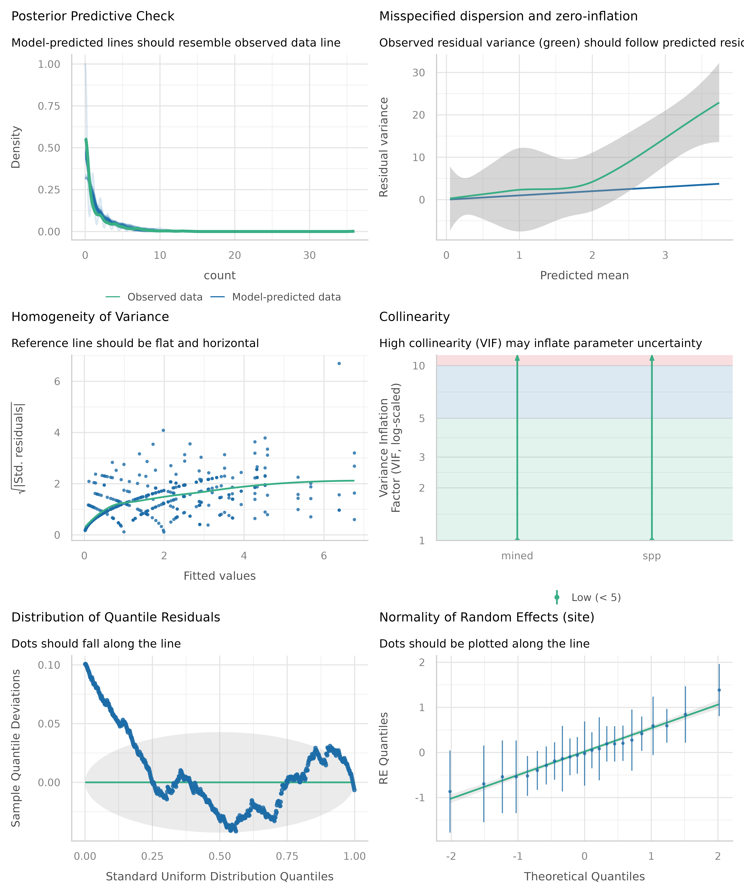

# Checking simulated residuals

The basic workflow for simulated residual checks using
[`simulate_residuals()`](https://easystats.github.io/performance/reference/simulate_residuals.md)
is as follows.

First, fit a model:

`model`` ``<-`` ``glmmTMB``::`[`glmmTMB`](https://rdrr.io/pkg/glmmTMB/man/glmmTMB.html)`(`` `` ``count`` ``~`` ``mined`` ``+`` ``spp`` ``+`` ``(``1`` ``|`` ``site``)``,`` `` family ``=`` ``poisson``,`` `` data ``=`` ``glmmTMB``::`[`Salamanders`](https://rdrr.io/pkg/glmmTMB/man/Salamanders.html)` ``)`

Next, simulate residuals from the model:

[`library`](https://rdrr.io/r/base/library.html)`(`[`performance`](https://easystats.github.io/performance/)`)`` ``simulated_residuals`` ``<-`` `[`simulate_residuals`](https://easystats.github.io/performance/reference/simulate_residuals.md)`(``model``)`` `` ``simulated_residuals`` ``` #> Simulated residuals from a model of class `glmmTMB` based on 250 ``` ``` #> simulations. Use `check_residuals()` to check uniformity of residuals or ``` ``` #> `residuals()` to extract simulated residuals. It is recommended to refer ``` ``` #> to `?DHARMa::simulateResiudals` and `vignette("DHARMa")` for more ``` ``#> information about different settings in particular situations or for`` ``#> particular models.`

The raw residuals can be extracted using
[`residuals()`](https://rdrr.io/r/stats/residuals.html):

[`head`](https://rdrr.io/r/utils/head.html)`(`[`residuals`](https://rdrr.io/r/stats/residuals.html)`(``simulated_residuals``)``)`` ``#> [1] 0.42 0.17 0.87 0.45 0.43 0.43`

Note that since this inherits the DHARMa class, all the methods
implemented in DHARMa just work, including all the tests:

`DHARMa``::`[`testUniformity`](https://rdrr.io/pkg/DHARMa/man/testUniformity.html)`(``simulated_residuals``, plot ``=`` ``FALSE``)`` ``#> `` ``#> Asymptotic one-sample Kolmogorov-Smirnov test`` ``#> `` ``#> data: simulationOutput$scaledResiduals`` ``#> D = 0.09, p-value = 3e-05`` ``#> alternative hypothesis: two-sided`

Finally, run specific checks on the simulated residuals:

[`check_residuals`](https://easystats.github.io/performance/reference/check_residuals.md)`(``simulated_residuals``)`` ``#> Warning: Non-uniformity of simulated residuals detected (p < .001).`

Further implemented checks are tests for overdispersion, outliers and
zero-inflation.

[`check_overdispersion`](https://easystats.github.io/performance/reference/check_overdispersion.md)`(``simulated_residuals``)`` ``#> # Overdispersion test (using simulated residuals)`` ``#> `` ``#> dispersion ratio = 3.040`` ``#> p-value = < 0.001`` ``#> Overdispersion detected.`` `` `[`check_zeroinflation`](https://easystats.github.io/performance/reference/check_zeroinflation.md)`(``simulated_residuals``)`` ``#> # Check for zero-inflation`` ``#> `` ``#> Observed zeros: 387`` ``#> Predicted zeros: 311`` ``#> Ratio: 0.80`` ``#> Model is underfitting zeros (probable zero-inflation) (p < .001).`` `` `[`check_outliers`](https://easystats.github.io/performance/reference/check_outliers.md)`(``simulated_residuals``)`` ``#> DHARMa:testOutliers with type = binomial may have inflated Type I error rates for integer-valued distributions. To get a more exact result, it is recommended to re-run testOutliers with type = 'bootstrap'. See ?testOutliers for details`` ``#> # Outliers detection`` ``#> `` ``#> Proportion of observed outliers: 5.12%`` ``#> Proportion of expected outliers: 0.80%, 95% CI [3.55, 7.12]`` ``#> Outliers were detected (p < .001).`

The above three functions internally call
[`simulate_residuals()`](https://easystats.github.io/performance/reference/simulate_residuals.md)
for more complex models automatically, so you don’t need to call
[`simulate_residuals()`](https://easystats.github.io/performance/reference/simulate_residuals.md)
yourself. Simulated residuals are usually more reliable than the
standard residuals, especially for complex models.

Finally, you can even perform a visual check for the entire model,
either by passing the model object directly, or the object returned from
[`simulate_residuals()`](https://easystats.github.io/performance/reference/simulate_residuals.md).

[`check_model`](https://easystats.github.io/performance/reference/check_model.md)`(``simulated_residuals``, size_dot ``=`` ``1.5``)`



The
[`check_model()`](https://easystats.github.io/performance/reference/check_model.md)
function is the main reason we don’t want to prematurely extract the
residuals in
[`simulate_residuals()`](https://easystats.github.io/performance/reference/simulate_residuals.md),
because if we do then the simulated residual won’t contain the model fit
(`fittedModel` in the output below), so we won’t be able to do all of
the checks we would want to do using the model (e.g., posterior
predictive checks).

[`str`](https://rdrr.io/r/utils/str.html)`(``simulated_residuals``, max.level ``=`` ``1``)`` ``#> List of 18`` ``#> $ fittedModel :List of 7`` ``#> ..- attr(*, "class")= chr "glmmTMB"`` ``#> $ modelClass : chr "glmmTMB"`` ``#> $ additionalParameters : list()`` ``#> $ nObs : int 644`` ``#> $ nSim : num 250`` ``#> $ simulateREs : chr "conditional"`` ``#> $ refit : logi FALSE`` ``#> $ observedResponse : int [1:644] 0 0 0 2 2 1 1 2 4 1 ...`` ``#> $ integerResponse : logi TRUE`` ``#> $ problems : list()`` ``#> $ fittedPredictedResponse: num [1:644] 0.197 0.197 0.197 1.896 1.896 ...`` ``#> $ fittedFixedEffects : Named num [1:8] -1.625 2.264 -1.386 0.231 -0.77 ...`` ``#> ..- attr(*, "names")= chr [1:8] "(Intercept)" "minedno" "sppPR" "sppDM" ...`` ``#> $ fittedResiduals : Named num [1:644] -0.2139 -0.7867 -0.0828 -0.2951 -0.2951 ...`` ``#> ..- attr(*, "names")= chr [1:644] "1" "2" "3" "4" ...`` ``#> $ method : chr [1:2] "PIT" "traditional"`` ``#> $ simulatedResponse : num [1:644, 1:250] 0 1 0 4 5 0 3 4 3 1 ...`` ``#> ..- attr(*, "dimnames")=List of 2`` ``#> $ scaledResiduals : num [1:644] 0.416 0.171 0.867 0.447 0.431 ...`` ``#> $ time : 'proc_time' Named num [1:5] 0.246 0.003 0.249 0 0`` ``#> ..- attr(*, "names")= chr [1:5] "user.self" "sys.self" "elapsed" "user.child" ...`` ``#> $ randomState :List of 4`` ``#> - attr(*, "class")= chr [1:3] "performance_simres" "see_performance_simres" "DHARMa"`
