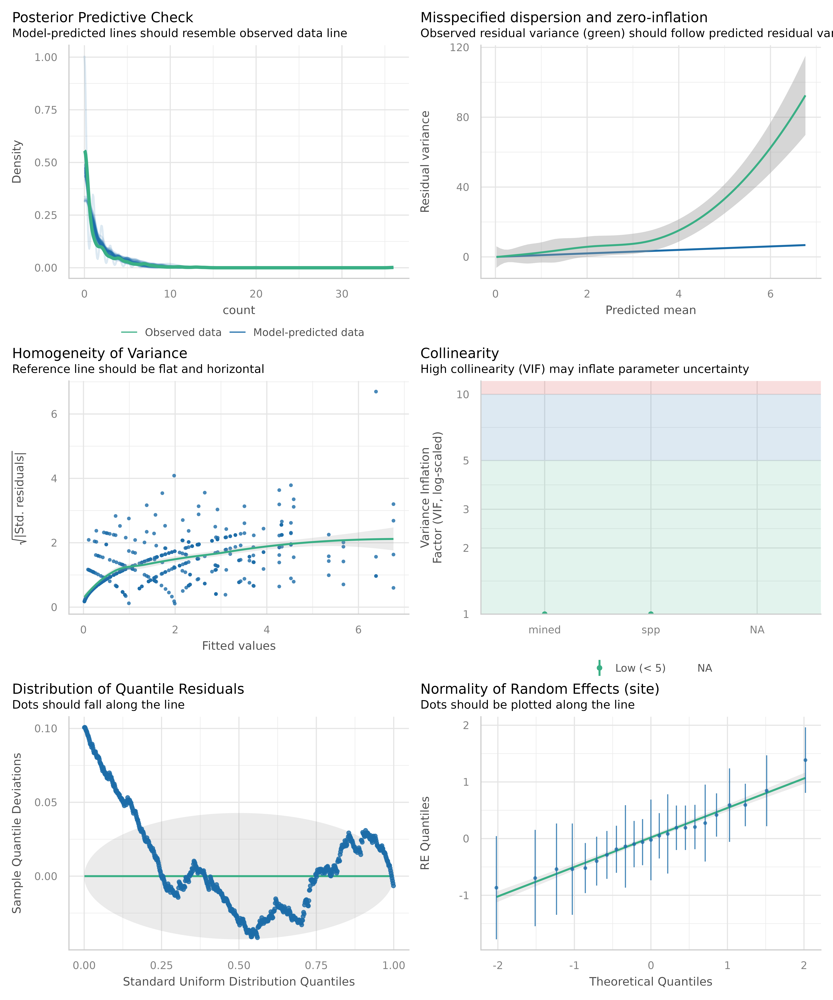

# Checking simulated residuals

The basic workflow for simulated residual checks using
[`simulate_residuals()`](https://easystats.github.io/performance/reference/simulate_residuals.md)
is as follows.

First, fit a model:

``` r

model <- glmmTMB::glmmTMB(
  count ~ mined + spp + (1 | site),
  family = poisson,
  data = glmmTMB::Salamanders
)
```

Next, simulate residuals from the model:

``` r

library(performance)
simulated_residuals <- simulate_residuals(model)

simulated_residuals
#> Simulated residuals from a model of class `glmmTMB` based on 250
#>   simulations. Use `check_residuals()` to check uniformity of residuals or
#>   `residuals()` to extract simulated residuals. It is recommended to refer
#>   to `?DHARMa::simulateResiudals` and `vignette("DHARMa")` for more
#>   information about different settings in particular situations or for
#>   particular models.
```

The raw residuals can be extracted using
[`residuals()`](https://rdrr.io/r/stats/residuals.html):

``` r

head(residuals(simulated_residuals))
#> [1] 0.15 0.73 0.45 0.50 0.44 0.22
```

Note that since this inherits the DHARMa class, all the methods
implemented in DHARMa just work, including all the tests:

``` r

DHARMa::testUniformity(simulated_residuals, plot = FALSE)
#> 
#>  Asymptotic one-sample Kolmogorov-Smirnov test
#> 
#> data:  simulationOutput$scaledResiduals
#> D = 0.08, p-value = 2e-04
#> alternative hypothesis: two-sided
```

Finally, run specific checks on the simulated residuals:

``` r

check_residuals(simulated_residuals)
#> Warning: Non-uniformity of simulated residuals detected (p < .001).
```

Further implemented checks are tests for overdispersion, outliers and
zero-inflation.

``` r

check_overdispersion(simulated_residuals)
#> # Overdispersion test
#> 
#>  dispersion ratio = 1.742
#>           p-value =   0.1
#> No overdispersion detected.

check_zeroinflation(simulated_residuals)
#> # Check for zero-inflation
#> 
#>    Observed zeros: 387
#>   Predicted zeros: 322
#>             Ratio: 0.83
#> Model is underfitting zeros (probable zero-inflation) (p < .001).

check_outliers(simulated_residuals)
#> DHARMa:testOutliers with type = binomial may have inflated Type I error rates for integer-valued distributions. To get a more exact result, it is recommended to re-run testOutliers with type = 'bootstrap'. See ?testOutliers for details
#> # Outliers detection
#> 
#>   Proportion of observed outliers: 2.33%
#>   Proportion of expected outliers: 0.80%, 95% CI [1.31, 3.81]
#> Outliers were detected (p < .001).
```

The above three functions internally call
[`simulate_residuals()`](https://easystats.github.io/performance/reference/simulate_residuals.md)
for more complex models automatically, so you don’t need to call
[`simulate_residuals()`](https://easystats.github.io/performance/reference/simulate_residuals.md)
yourself. Simulated residuals are usually more reliable than the
standard residuals, especially for complex models.

Finally, you can even perform a visual check for the entire model,
either by passing the model object directly, or the object returned from
[`simulate_residuals()`](https://easystats.github.io/performance/reference/simulate_residuals.md).

``` r

check_model(simulated_residuals, size_dot = 1.5)
```



The
[`check_model()`](https://easystats.github.io/performance/reference/check_model.md)
function is the main reason we don’t want to prematurely extract the
residuals in
[`simulate_residuals()`](https://easystats.github.io/performance/reference/simulate_residuals.md),
because if we do then the simulated residual won’t contain the model fit
(`fittedModel` in the output below), so we won’t be able to do all of
the checks we would want to do using the model (e.g., posterior
predictive checks).

``` r

str(simulated_residuals, max.level = 1)
#> List of 17
#>  $ fittedModel            :List of 7
#>   ..- attr(*, "class")= chr "glmmTMB"
#>  $ modelClass             : chr "glmmTMB"
#>  $ additionalParameters   : list()
#>  $ nObs                   : int 644
#>  $ nSim                   : num 250
#>  $ refit                  : logi FALSE
#>  $ observedResponse       : int [1:644] 0 0 0 2 2 1 1 2 4 1 ...
#>  $ integerResponse        : logi TRUE
#>  $ problems               : list()
#>  $ fittedPredictedResponse: num [1:644] 0.197 0.197 0.197 1.896 1.896 ...
#>  $ fittedFixedEffects     : Named num [1:8] -1.625 2.264 -1.386 0.231 -0.77 ...
#>   ..- attr(*, "names")= chr [1:8] "(Intercept)" "minedno" "sppPR" "sppDM" ...
#>  $ fittedResiduals        : Named num [1:644] -0.2139 -0.7867 -0.0828 -0.2951 -0.2951 ...
#>   ..- attr(*, "names")= chr [1:644] "1" "2" "3" "4" ...
#>  $ method                 : chr [1:2] "PIT" "traditional"
#>  $ simulatedResponse      : num [1:644, 1:250] 0 0 0 3 0 4 3 0 5 1 ...
#>   ..- attr(*, "dimnames")=List of 2
#>  $ scaledResiduals        : num [1:644] 0.155 0.731 0.448 0.498 0.437 ...
#>  $ time                   : 'proc_time' Named num [1:5] 0.093 0.021 0.114 0 0
#>   ..- attr(*, "names")= chr [1:5] "user.self" "sys.self" "elapsed" "user.child" ...
#>  $ randomState            :List of 4
#>  - attr(*, "class")= chr [1:3] "performance_simres" "see_performance_simres" "DHARMa"
```
