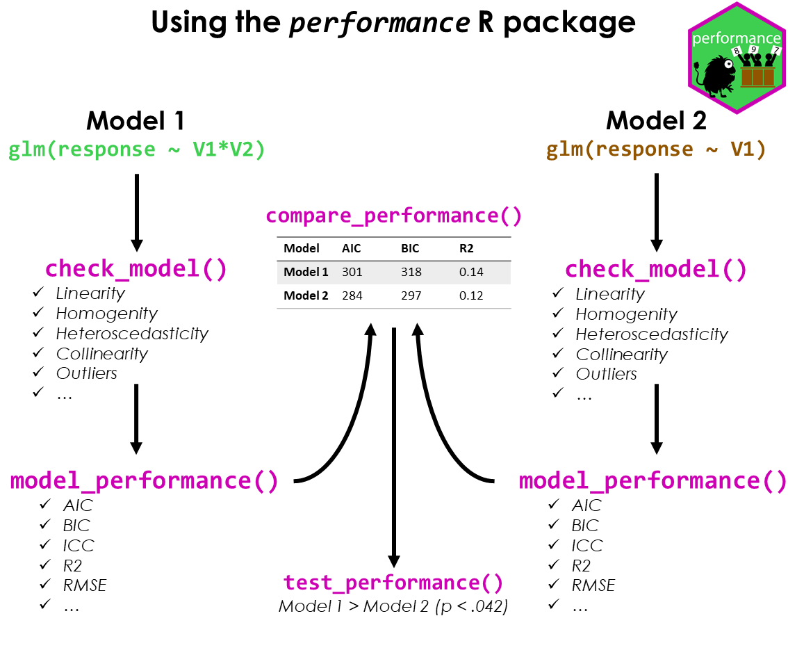
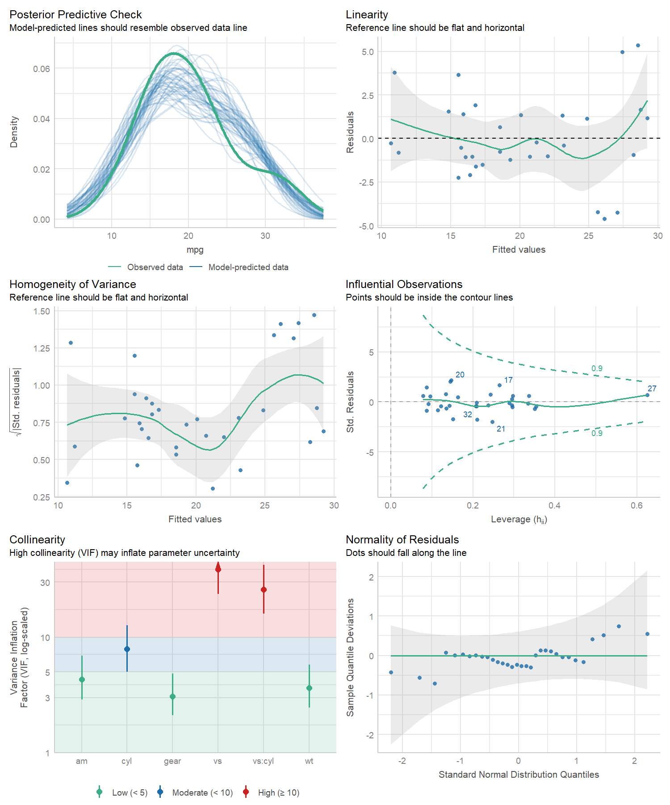
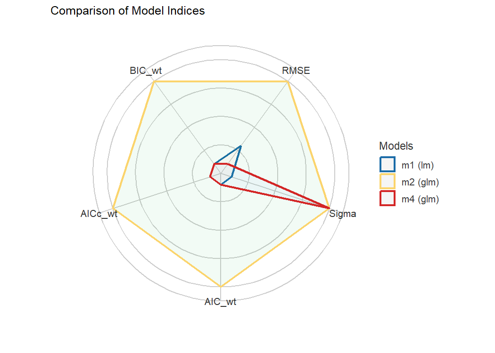

# performance

***Test if your model is a good model!***

A crucial aspect when building regression models is to evaluate the
quality of modelfit. It is important to investigate how well models fit
to the data and which fit indices to report. Functions to create
diagnostic plots or to compute fit measures do exist, however, mostly
spread over different packages. There is no unique and consistent
approach to assess the model quality for different kind of models.

The primary goal of the **performance** package is to fill this gap and
to provide utilities for computing **indices of model quality** and
**goodness of fit**. These include measures like r-squared (R2), root
mean squared error (RMSE) or intraclass correlation coefficient (ICC) ,
but also functions to check (mixed) models for overdispersion,
zero-inflation, convergence or singularity.

## Installation

The *performance* package is available on CRAN, while its latest
development version is available on R-universe (from *rOpenSci*).

| Type | Source | Command |
|----|----|----|
| Release | CRAN | `install.packages("performance")` |
| Development | R-universe | `install.packages("performance", repos = "https://easystats.r-universe.dev")` |

Once you have downloaded the package, you can then load it using:

[`library`](https://rdrr.io/r/base/library.html)`(`[`"performance"`](https://easystats.github.io/performance/)`)`

> **Tip**
>
> Instead of
> [`library(performance)`](https://easystats.github.io/performance/),
> use [`library(easystats)`](https://easystats.github.io/easystats/).
> This will make all features of the easystats-ecosystem available.
>
> To stay updated, use `easystats::install_latest()`.

## Citation

To cite performance in publications use:

[`citation`](https://rdrr.io/r/utils/citation.html)`(``"performance"``)`` ``#> To cite package 'performance' in publications use:`` ``#> `` ``#> Lüdecke et al., (2021). performance: An R Package for Assessment, Comparison and`` ``#> Testing of Statistical Models. Journal of Open Source Software, 6(60), 3139.`` ``#> https://doi.org/10.21105/joss.03139`` ``#> `` ``#> A BibTeX entry for LaTeX users is`` ``#> `` ``#> @Article{,`` ``#> title = {{performance}: An {R} Package for Assessment, Comparison and Testing of Statistical Models},`` ``#> author = {Daniel Lüdecke and Mattan S. Ben-Shachar and Indrajeet Patil and Philip Waggoner and Dominique Makowski},`` ``#> year = {2021},`` ``#> journal = {Journal of Open Source Software},`` ``#> volume = {6},`` ``#> number = {60},`` ``#> pages = {3139},`` ``#> doi = {10.21105/joss.03139},`` ``#> }`

## Documentation

There is a nice introduction into the package on
[youtube](https://www.youtube.com/watch?v=EPIxQ5i5oxs).

## The *performance* workflow

### Assessing model quality

#### R-squared

**performance** has a generic
[`r2()`](https://easystats.github.io/performance/reference/r2.md)
function, which computes the r-squared for many different models,
including mixed effects and Bayesian regression models.

[`r2()`](https://easystats.github.io/performance/reference/r2.md)
returns a list containing values related to the “most appropriate”
r-squared for the given model.

`model`` ``<-`` `[`lm`](https://rdrr.io/r/stats/lm.html)`(``mpg`` ``~`` ``wt`` ``+`` ``cyl``, data ``=`` ``mtcars``)`` `[`r2`](https://easystats.github.io/performance/reference/r2.md)`(``model``)`` ``#> # R2 for Linear Regression`` ``#> R2: 0.830`` ``#> adj. R2: 0.819`` `` ``model`` ``<-`` `[`glm`](https://rdrr.io/r/stats/glm.html)`(``am`` ``~`` ``wt`` ``+`` ``cyl``, data ``=`` ``mtcars``, family ``=`` ``binomial``)`` `[`r2`](https://easystats.github.io/performance/reference/r2.md)`(``model``)`` ``#> # R2 for Logistic Regression`` ``#> Tjur's R2: 0.705`` `` `[`library`](https://rdrr.io/r/base/library.html)`(`[`MASS`](http://www.stats.ox.ac.uk/pub/MASS4/)`)`` `[`data`](https://rdrr.io/r/utils/data.html)`(``housing``)`` ``model`` ``<-`` `[`polr`](https://rdrr.io/pkg/MASS/man/polr.html)`(``Sat`` ``~`` ``Infl`` ``+`` ``Type`` ``+`` ``Cont``, weights ``=`` ``Freq``, data ``=`` ``housing``)`` `[`r2`](https://easystats.github.io/performance/reference/r2.md)`(``model``)`` ``#> Nagelkerke's R2: 0.108`

The different R-squared measures can also be accessed directly via
functions like
[`r2_bayes()`](https://easystats.github.io/performance/reference/r2_bayes.md),
[`r2_coxsnell()`](https://easystats.github.io/performance/reference/r2_coxsnell.md)
or
[`r2_nagelkerke()`](https://easystats.github.io/performance/reference/r2_nagelkerke.md)
(see a full list of functions
[here](https://easystats.github.io/performance/reference/index.html#section-r-functions)).

For mixed models, the *conditional* and *marginal* R-squared are
returned. The *marginal R-squared* considers only the variance of the
fixed effects and indicates how much of the model’s variance is
explained by the fixed effects part only. The *conditional R-squared*
takes both the fixed and random effects into account and indicates how
much of the model’s variance is explained by the “complete” model.

For frequentist mixed models,
[`r2()`](https://easystats.github.io/performance/reference/r2.md) (resp.
[`r2_nakagawa()`](https://easystats.github.io/performance/reference/r2_nakagawa.md))
computes the *mean* random effect variances, thus
[`r2()`](https://easystats.github.io/performance/reference/r2.md) is
also appropriate for mixed models with more complex random effects
structures, like random slopes or nested random effects (Johnson 2014;
Nakagawa, Johnson, and Schielzeth 2017).

[`set.seed`](https://rdrr.io/r/base/Random.html)`(``123``)`` `[`library`](https://rdrr.io/r/base/library.html)`(`[`rstanarm`](https://mc-stan.org/rstanarm/)`)`` `` ``model`` ``<-`` `[`stan_glmer`](https://mc-stan.org/rstanarm/reference/stan_glmer.html)`(`` `` ``Petal.Length`` ``~`` ``Petal.Width`` ``+`` ``(``1`` ``|`` ``Species``)``,`` `` data ``=`` ``iris``,`` `` cores ``=`` ``4`` ``)`` `` `[`r2`](https://easystats.github.io/performance/reference/r2.md)`(``model``)`` ``#> # Bayesian R2 with Compatibility Interval`` ``#> `` ``#> Conditional R2: 0.954 (95% CI [0.951, 0.957])`` ``#> Marginal R2: 0.414 (95% CI [0.204, 0.644])`` `` `[`library`](https://rdrr.io/r/base/library.html)`(`[`lme4`](https://github.com/lme4/lme4/)`)`` ``model`` ``<-`` `[`lmer`](https://rdrr.io/pkg/lme4/man/lmer.html)`(``Reaction`` ``~`` ``Days`` ``+`` ``(``1`` ``+`` ``Days`` ``|`` ``Subject``)``, data ``=`` ``sleepstudy``)`` `[`r2`](https://easystats.github.io/performance/reference/r2.md)`(``model``)`` ``#> # R2 for Mixed Models`` ``#> `` ``#> Conditional R2: 0.799`` ``#> Marginal R2: 0.279`

#### Intraclass Correlation Coefficient (ICC)

Similar to R-squared, the ICC provides information on the explained
variance and can be interpreted as “the proportion of the variance
explained by the grouping structure in the population” (Hox 2010).

[`icc()`](https://easystats.github.io/performance/reference/icc.md)
calculates the ICC for various mixed model objects, including `stanreg`
models.

[`library`](https://rdrr.io/r/base/library.html)`(`[`lme4`](https://github.com/lme4/lme4/)`)`` ``model`` ``<-`` `[`lmer`](https://rdrr.io/pkg/lme4/man/lmer.html)`(``Reaction`` ``~`` ``Days`` ``+`` ``(``1`` ``+`` ``Days`` ``|`` ``Subject``)``, data ``=`` ``sleepstudy``)`` `[`icc`](https://easystats.github.io/performance/reference/icc.md)`(``model``)`` ``#> # Intraclass Correlation Coefficient`` ``#> `` ``#> Adjusted ICC: 0.722`` ``#> Unadjusted ICC: 0.521`

…and models of class `brmsfit`.

[`library`](https://rdrr.io/r/base/library.html)`(`[`brms`](https://github.com/paul-buerkner/brms)`)`` `[`set.seed`](https://rdrr.io/r/base/Random.html)`(``123``)`` ``model`` ``<-`` `[`brm`](https://paulbuerkner.com/brms/reference/brm.html)`(``mpg`` ``~`` ``wt`` ``+`` ``(``1`` ``|`` ``cyl``)`` ``+`` ``(``1`` ``+`` ``wt`` ``|`` ``gear``)``, data ``=`` ``mtcars``)`

[`icc`](https://easystats.github.io/performance/reference/icc.md)`(``model``)`` ``#> # Intraclass Correlation Coefficient`` ``#> `` ``#> Adjusted ICC: 0.930`` ``#> Unadjusted ICC: 0.771`

### Model diagnostics

#### Check for overdispersion

Overdispersion occurs when the observed variance in the data is higher
than the expected variance from the model assumption (for Poisson,
variance roughly equals the mean of an outcome).
[`check_overdispersion()`](https://easystats.github.io/performance/reference/check_overdispersion.md)
checks if a count model (including mixed models) is overdispersed or
not.

[`library`](https://rdrr.io/r/base/library.html)`(`[`glmmTMB`](https://github.com/glmmTMB/glmmTMB)`)`` `[`data`](https://rdrr.io/r/utils/data.html)`(``Salamanders``)`` ``model`` ``<-`` `[`glm`](https://rdrr.io/r/stats/glm.html)`(``count`` ``~`` ``spp`` ``+`` ``mined``, family ``=`` ``poisson``, data ``=`` ``Salamanders``)`` `[`check_overdispersion`](https://easystats.github.io/performance/reference/check_overdispersion.md)`(``model``)`` ``#> # Overdispersion test`` ``#> `` ``#> dispersion ratio = 2.946`` ``#> Pearson's Chi-Squared = 1873.710`` ``#> p-value = < 0.001`

Overdispersion can be fixed by either modelling the dispersion parameter
(not possible with all packages), or by choosing a different
distributional family (like Quasi-Poisson, or negative binomial, see
(Gelman and Hill 2007)).

#### Check for zero-inflation

Zero-inflation (in (Quasi-)Poisson models) is indicated when the amount
of observed zeros is larger than the amount of predicted zeros, so the
model is *underfitting* zeros. In such cases, it is recommended to use
negative binomial or zero-inflated models.

Use
[`check_zeroinflation()`](https://easystats.github.io/performance/reference/check_zeroinflation.md)
to check if zero-inflation is present in the fitted model.

`model`` ``<-`` `[`glm`](https://rdrr.io/r/stats/glm.html)`(``count`` ``~`` ``spp`` ``+`` ``mined``, family ``=`` ``poisson``, data ``=`` ``Salamanders``)`` `[`check_zeroinflation`](https://easystats.github.io/performance/reference/check_zeroinflation.md)`(``model``)`` ``#> # Check for zero-inflation`` ``#> `` ``#> Observed zeros: 387`` ``#> Predicted zeros: 298`` ``#> Ratio: 0.77`

#### Check for singular model fits

A “singular” model fit means that some dimensions of the
variance-covariance matrix have been estimated as exactly zero. This
often occurs for mixed models with overly complex random effects
structures.

[`check_singularity()`](https://easystats.github.io/performance/reference/check_singularity.md)
checks mixed models (of class `lme`, `merMod`, `glmmTMB` or `MixMod`)
for singularity, and returns `TRUE` if the model fit is singular.

[`library`](https://rdrr.io/r/base/library.html)`(`[`lme4`](https://github.com/lme4/lme4/)`)`` `[`data`](https://rdrr.io/r/utils/data.html)`(``sleepstudy``)`` `` ``# prepare data`` `[`set.seed`](https://rdrr.io/r/base/Random.html)`(``123``)`` ``sleepstudy``$``mygrp`` ``<-`` `[`sample`](https://rdrr.io/r/base/sample.html)`(``1``:``5``, size ``=`` ``180``, replace ``=`` ``TRUE``)`` ``sleepstudy``$``mysubgrp`` ``<-`` ``NA`` ``for`` ``(``i`` ``in`` ``1``:``5``)`` ``{`` `` ``filter_group`` ``<-`` ``sleepstudy``$``mygrp`` ``==`` ``i`` `` ``sleepstudy``$``mysubgrp``[``filter_group``]`` ``<-`` `` `[`sample`](https://rdrr.io/r/base/sample.html)`(``1``:``30``, size ``=`` `[`sum`](https://rdrr.io/r/base/sum.html)`(``filter_group``)``, replace ``=`` ``TRUE``)`` ``}`` `` ``# fit strange model`` ``model`` ``<-`` `[`lmer`](https://rdrr.io/pkg/lme4/man/lmer.html)`(`` `` ``Reaction`` ``~`` ``Days`` ``+`` ``(``1`` ``|`` ``mygrp`` ``/`` ``mysubgrp``)`` ``+`` ``(``1`` ``|`` ``Subject``)``,`` `` data ``=`` ``sleepstudy`` ``)`` `` `[`check_singularity`](https://easystats.github.io/performance/reference/check_singularity.md)`(``model``)`` ``#> [1] TRUE`

Remedies to cure issues with singular fits can be found
[here](https://easystats.github.io/performance/reference/check_singularity.html).

#### Check for heteroskedasticity

Linear models assume constant error variance (homoskedasticity).

The
[`check_heteroscedasticity()`](https://easystats.github.io/performance/reference/check_heteroscedasticity.md)
functions assess if this assumption has been violated:

[`data`](https://rdrr.io/r/utils/data.html)`(``cars``)`` ``model`` ``<-`` `[`lm`](https://rdrr.io/r/stats/lm.html)`(``dist`` ``~`` ``speed``, data ``=`` ``cars``)`` `` `[`check_heteroscedasticity`](https://easystats.github.io/performance/reference/check_heteroscedasticity.md)`(``model``)`` ``#> Warning: Heteroscedasticity (non-constant error variance) detected (p = 0.031).`

#### Comprehensive visualization of model checks

**performance** provides many functions to check model assumptions, like
[`check_collinearity()`](https://easystats.github.io/performance/reference/check_collinearity.md),
[`check_normality()`](https://easystats.github.io/performance/reference/check_normality.md)
or
[`check_heteroscedasticity()`](https://easystats.github.io/performance/reference/check_heteroscedasticity.md).
To get a comprehensive check, use
[`check_model()`](https://easystats.github.io/performance/reference/check_model.md).

`# defining a model`` ``model`` ``<-`` `[`lm`](https://rdrr.io/r/stats/lm.html)`(``mpg`` ``~`` ``wt`` ``+`` ``am`` ``+`` ``gear`` ``+`` ``vs`` ``*`` ``cyl``, data ``=`` ``mtcars``)`` `` ``# checking model assumptions`` `[`check_model`](https://easystats.github.io/performance/reference/check_model.md)`(``model``)`

### Model performance summaries

[`model_performance()`](https://easystats.github.io/performance/reference/model_performance.md)
computes indices of model performance for regression models. Depending
on the model object, typical indices might be r-squared, AIC, BIC, RMSE,
ICC or LOOIC.

#### Linear model

`m1`` ``<-`` `[`lm`](https://rdrr.io/r/stats/lm.html)`(``mpg`` ``~`` ``wt`` ``+`` ``cyl``, data ``=`` ``mtcars``)`` `[`model_performance`](https://easystats.github.io/performance/reference/model_performance.md)`(``m1``)`` ``#> # Indices of model performance`` ``#> `` ``#> AIC | AICc | BIC | R2 | R2 (adj.) | RMSE | Sigma`` ``#> ---------------------------------------------------------------`` ``#> 156.010 | 157.492 | 161.873 | 0.830 | 0.819 | 2.444 | 2.568`

#### Logistic regression

`m2`` ``<-`` `[`glm`](https://rdrr.io/r/stats/glm.html)`(``vs`` ``~`` ``wt`` ``+`` ``mpg``, data ``=`` ``mtcars``, family ``=`` ``"binomial"``)`` `[`model_performance`](https://easystats.github.io/performance/reference/model_performance.md)`(``m2``)`` ``#> # Indices of model performance`` ``#> `` ``#> AIC | AICc | BIC | Tjur's R2 | RMSE | Sigma | Log_loss | Score_log | Score_spherical | PCP`` ``#> -----------------------------------------------------------------------------------------------------`` ``#> 31.298 | 32.155 | 35.695 | 0.478 | 0.359 | 1.000 | 0.395 | -14.903 | 0.095 | 0.743`

#### Linear mixed model

[`library`](https://rdrr.io/r/base/library.html)`(`[`lme4`](https://github.com/lme4/lme4/)`)`` ``m3`` ``<-`` `[`lmer`](https://rdrr.io/pkg/lme4/man/lmer.html)`(``Reaction`` ``~`` ``Days`` ``+`` ``(``1`` ``+`` ``Days`` ``|`` ``Subject``)``, data ``=`` ``sleepstudy``)`` `[`model_performance`](https://easystats.github.io/performance/reference/model_performance.md)`(``m3``)`` ``#> # Indices of model performance`` ``#> `` ``#> AIC | AICc | BIC | R2 (cond.) | R2 (marg.) | ICC | RMSE | Sigma`` ``#> ----------------------------------------------------------------------------------`` ``#> 1755.628 | 1756.114 | 1774.786 | 0.799 | 0.279 | 0.722 | 23.438 | 25.592`

### Models comparison

The
[`compare_performance()`](https://easystats.github.io/performance/reference/compare_performance.md)
function can be used to compare the performance and quality of several
models (including models of different types).

`counts`` ``<-`` `[`c`](https://rdrr.io/r/base/c.html)`(``18``, ``17``, ``15``, ``20``, ``10``, ``20``, ``25``, ``13``, ``12``)`` ``outcome`` ``<-`` `[`gl`](https://rdrr.io/r/base/gl.html)`(``3``, ``1``, ``9``)`` ``treatment`` ``<-`` `[`gl`](https://rdrr.io/r/base/gl.html)`(``3``, ``3``)`` ``m4`` ``<-`` `[`glm`](https://rdrr.io/r/stats/glm.html)`(``counts`` ``~`` ``outcome`` ``+`` ``treatment``, family ``=`` `[`poisson`](https://rdrr.io/r/stats/family.html)`(``)``)`` `` `[`compare_performance`](https://easystats.github.io/performance/reference/compare_performance.md)`(``m1``, ``m2``, ``m3``, ``m4``, verbose ``=`` ``FALSE``)`` ``#> # Comparison of Model Performance Indices`` ``#> `` ``#> Name | Model | AIC (weights) | AICc (weights) | BIC (weights) | RMSE | Sigma | Score_log`` ``#> -----------------------------------------------------------------------------------------------`` ``#> m1 | lm | 156.0 (<.001) | 157.5 (<.001) | 161.9 (<.001) | 2.444 | 2.568 | `` ``#> m2 | glm | 31.3 (>.999) | 32.2 (>.999) | 35.7 (>.999) | 0.359 | 1.000 | -14.903`` ``#> m3 | lmerMod | 1764.0 (<.001) | 1764.5 (<.001) | 1783.1 (<.001) | 23.438 | 25.592 | `` ``#> m4 | glm | 56.8 (<.001) | 76.8 (<.001) | 57.7 (<.001) | 3.043 | 1.000 | -2.598`` ``#> `` ``#> Name | Score_spherical | R2 | R2 (adj.) | Tjur's R2 | Log_loss | PCP | R2 (cond.) | R2 (marg.)`` ``#> ---------------------------------------------------------------------------------------------------`` ``#> m1 | | 0.830 | 0.819 | | | | | `` ``#> m2 | 0.095 | | | 0.478 | 0.395 | 0.743 | | `` ``#> m3 | | | | | | | 0.799 | 0.279`` ``#> m4 | 0.324 | | | | | | | `` ``#> `` ``#> Name | ICC | Nagelkerke's R2`` ``#> ------------------------------`` ``#> m1 | | `` ``#> m2 | | `` ``#> m3 | 0.722 | `` ``#> m4 | | 0.657`

#### General index of model performance

One can also easily compute and a [**composite
index**](https://easystats.github.io/performance/reference/compare_performance.html#details)
of model performance and sort the models from the best one to the worse.

[`compare_performance`](https://easystats.github.io/performance/reference/compare_performance.md)`(``m1``, ``m2``, ``m3``, ``m4``, rank ``=`` ``TRUE``, verbose ``=`` ``FALSE``)`` ``#> # Comparison of Model Performance Indices`` ``#> `` ``#> Name | Model | RMSE | Sigma | AIC weights | AICc weights | BIC weights | Performance-Score`` ``#> -----------------------------------------------------------------------------------------------`` ``#> m2 | glm | 0.359 | 1.000 | 1.000 | 1.000 | 1.000 | 100.00%`` ``#> m4 | glm | 3.043 | 1.000 | 2.96e-06 | 2.06e-10 | 1.63e-05 | 37.67%`` ``#> m1 | lm | 2.444 | 2.568 | 8.30e-28 | 6.07e-28 | 3.99e-28 | 36.92%`` ``#> m3 | lmerMod | 23.438 | 25.592 | 0.00e+00 | 0.00e+00 | 0.00e+00 | 0.00%`

#### Visualisation of indices of models’ performance

Finally, we provide convenient visualisation (the `see` package must be
installed).

[`plot`](https://rdrr.io/r/graphics/plot.default.html)`(`[`compare_performance`](https://easystats.github.io/performance/reference/compare_performance.md)`(``m1``, ``m2``, ``m4``, rank ``=`` ``TRUE``, verbose ``=`` ``FALSE``)``)`

### Testing models

[`test_performance()`](https://easystats.github.io/performance/reference/test_performance.md)
(and `test_bf`, its Bayesian sister) carries out the most relevant and
appropriate tests based on the input (for instance, whether the models
are nested or not).

[`set.seed`](https://rdrr.io/r/base/Random.html)`(``123``)`` `[`data`](https://rdrr.io/r/utils/data.html)`(``iris``)`` `` ``lm1`` ``<-`` `[`lm`](https://rdrr.io/r/stats/lm.html)`(``Sepal.Length`` ``~`` ``Species``, data ``=`` ``iris``)`` ``lm2`` ``<-`` `[`lm`](https://rdrr.io/r/stats/lm.html)`(``Sepal.Length`` ``~`` ``Species`` ``+`` ``Petal.Length``, data ``=`` ``iris``)`` ``lm3`` ``<-`` `[`lm`](https://rdrr.io/r/stats/lm.html)`(``Sepal.Length`` ``~`` ``Species`` ``*`` ``Sepal.Width``, data ``=`` ``iris``)`` ``lm4`` ``<-`` `[`lm`](https://rdrr.io/r/stats/lm.html)`(``Sepal.Length`` ``~`` ``Species`` ``*`` ``Sepal.Width`` ``+`` ``Petal.Length`` ``+`` ``Petal.Width``, data ``=`` ``iris``)`` `` `[`test_performance`](https://easystats.github.io/performance/reference/test_performance.md)`(``lm1``, ``lm2``, ``lm3``, ``lm4``)`` ``#> Name | Model | BF | Omega2 | p (Omega2) | LR | p (LR)`` ``#> ------------------------------------------------------------`` ``#> lm1 | lm | | | | | `` ``#> lm2 | lm | > 1000 | 0.69 | < .001 | -6.25 | < .001`` ``#> lm3 | lm | > 1000 | 0.36 | < .001 | -3.44 | < .001`` ``#> lm4 | lm | > 1000 | 0.73 | < .001 | -7.77 | < .001`` ``#> Each model is compared to lm1.`` `` `[`test_bf`](https://easystats.github.io/performance/reference/test_performance.md)`(``lm1``, ``lm2``, ``lm3``, ``lm4``)`` ``#> Bayes Factors for Model Comparison`` ``#> `` ``#> Model BF`` ``#> [lm2] Species + Petal.Length 3.45e+26`` ``#> [lm3] Species * Sepal.Width 4.69e+07`` ``#> [lm4] Species * Sepal.Width + Petal.Length + Petal.Width 7.58e+29`` ``#> `` ``#> * Against Denominator: [lm1] Species`` ``#> * Bayes Factor Type: BIC approximation`

### Plotting Functions

Plotting functions are available through the [**see**
package](https://easystats.github.io/see/articles/performance.html).

# Code of Conduct

Please note that the performance project is released with a [Contributor
Code of
Conduct](https://easystats.github.io/performance/CODE_OF_CONDUCT.html).
By contributing to this project, you agree to abide by its terms.

# Contributing

We are happy to receive bug reports, suggestions, questions, and (most
of all) contributions to fix problems and add features.

Please follow contributing guidelines mentioned here:

<https://easystats.github.io/performance/CONTRIBUTING.html>

## References

Gelman, Andrew, and Jennifer Hill. 2007. *Data Analysis Using Regression
and Multilevel/Hierarchical Models*. Analytical Methods for Social
Research. Cambridge ; New York: Cambridge University Press.

Hox, J. J. 2010. *Multilevel Analysis: Techniques and Applications*. 2nd
ed. Quantitative Methodology Series. New York: Routledge.

Johnson, Paul C. D. 2014. “Extension of Nakagawa & Schielzeth’s R2 GLMM
to Random Slopes Models.” Edited by Robert B. O’Hara. *Methods in
Ecology and Evolution* 5 (9): 944–46.

Nakagawa, Shinichi, Paul C. D. Johnson, and Holger Schielzeth. 2017.
“The Coefficient of Determination R2 and Intra-Class Correlation
Coefficient from Generalized Linear Mixed-Effects Models Revisited and
Expanded.” *Journal of The Royal Society Interface* 14 (134): 20170213.
