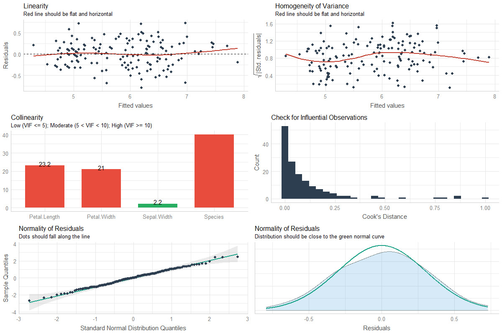

# Summary

A crucial aspect in statistical analysis, particularly with regression models,
is to evaluate the quality of modelfit. During data analysis, researchers should
investigate how well models fit to the data to find out whether the best model
has been chosen. In the context of reporting results, fit indices should be
mentioned, so that readers can judge the quality of regression models. Functions
to create diagnostic plots or to compute fit measures do exist, however, these
are located in many different packages, and there is no unique and consistent
approach to assess the model quality for different kind of models. This makes it
hard for researchers to discover the package they need or to find out whether
any packages for specific regression models exist at all.

# Aims of the Package

*performance* is an R-package [@rcore] that provides utilities for computing
measures to assess model quality, which are not directly provided by R's *base*
or *stats* packages. These include measures like $R^2$, intraclass correlation
coefficient, root mean squared error, etc., or functions to check models for
overdispersion, singularity or zero-inflation, and more. These functions support
a large variety of regression models, including generalized linear models,
mixed-effects models, their Bayesian cousins, and more.

*performance* is part of the
[*easystats*](https://github.com/easystats/performance) ecosystem, a
collaborative project created to facilitate the usage of R for statistical
analyses [@benshachar2020effectsize; @ludecke2020see; @Lüdecke2020parameters;
@makowski2019bayetestR; @Makowski2020correlation].

# Comparison to other Packages

- *lmtest* [@lmtest]

- *MuMIn::r.squaredGLMM()* [@MuMin]

- *car* [@car]

- *broom::glance()* [@robinson_broom_2020]

# Features

*performance* functions also include plotting capabilities via the [*see*
package](https://easystats.github.io/see/) [@ludecke2020see]. A complete
overview of plotting functions is available at the *see* website
(https://easystats.github.io/see/articles/performance.html).

## Checking if a Model is Valid

When a model is specified to describe the empirical data, its validity needs to
be checked by assessing if any of the underlying assumptions are violated. These
assumptions vary based on the model and *performance* offers a collection of
functions to check them. We will look at a couple of them before we mention the
key function that runs a comprehensive suite of checks in one go.

Linear models assume constant error variance (homoskedasticity), and
`check_heteroscedasticity()` functions in *performance* checks if this
assumption has been violated:

``` r
data(cars)
model <- lm(dist ~ speed, data = cars)

check_heteroscedasticity(model)
#> Warning: Heteroscedasticity (non-constant error variance) detected (p = 0.031).
```

Another concern for regression models can be overdispersion, which occurs when
the observed variance in the data is higher than the expected variance from the
model assumption. The `check_overdispersion()` in *performance* checks this
assumption.

```r
library(glmmTMB)
data(Salamanders)
model <- glm(count ~ spp + mined, family = poisson, data = Salamanders)
check_overdispersion(model)
#> # Overdispersion test
#> 
#>        dispersion ratio =    2.946
#>   Pearson's Chi-Squared = 1873.710
#>                 p-value =  < 0.001
```

In addition to providing such numerical indices of model fits, *performance*
also provides convenience functions to *visually* assess statistical assumptions
for regression models. Moreover, these visual checks adjust to the object
entered and support various regression models, like linear models, linear
mixed-effects models, their Bayesian equivalents, and more. 

Here we show what the function output looks like for linear models:

<!-- TO DO: Regenerate plot once feedback from other has been incorporated -->

```r
library(see)
model <- lm(Sepal.Length ~ Species + Sepal.Width + 
            Petal.Length + Petal.Width, data = iris)
check_model(model)
```



## Computing Quality of Model

<!-- Here I'd start with like some of the individual indices and then finish on
"you can get them all at once with model_performance - D.M. -->

*performance* offers a number of indices to assess the goodness of fit of a
model. We will discuss only a few before discussing a key function that
returns all of these indices in one fell swoop.

For example, $R^2$, also known as the coefficient of determination, is a popular
statistical measure to gauges how much of the variance in the dependent variable
is accounted for by the specified model. The `r2()` function in *performance*
can compute this index for a wide variety of regression models. Depending on the
model, $R^2$, pseudo-$R^2$, or marginal / adjusted $R^2$, etc. values are
returned.

Example with linear regression model:

```r
model <- lm(mpg ~ wt + cyl, data = mtcars)

r2(model)
#> # R2 for Linear Regression
#> 
#>        R2: 0.830
#>   adj. R2: 0.819
```

Example with generalized Bayesian mixed-effects model:

```r
library(rstanarm)
model <- stan_glmer(
  Petal.Length ~ Petal.Width + (1 | Species),
  data = iris,
  cores = 4
)

r2(model)
#> # Bayesian R2 with Standard Error
#> 
#>   Conditional R2: 0.953 (0.89% CI [0.944, 0.962])
#>      Marginal R2: 0.824 (0.89% CI [0.748, 0.890])
```

Similar to $R^2$, the Intraclass Correlation Coefficient (ICC) provides
information on the explained variance and can be interpreted as the proportion
of the variance explained by the grouping structure in the population
[@hox2017multilevel]. The `icc()` function in *performance* calculates the ICC
for various mixed-effects regression models.

``` r
library(brms)
set.seed(123)
model <- brm(mpg ~ wt + (1 | cyl) + (1 + wt | gear), data = mtcars)

icc(model)
#> # Intraclass Correlation Coefficient
#> 
#>      Adjusted ICC: 0.930
#>   Conditional ICC: 0.771
```

The `model_performance()` function is the workhorse of this package when it
comes to extracting a comprehensive set of model fit indices from various models
in a consistent manner. Depending on the regression model object, the list of
computed indices might include $R^2$, AIC, BIC, RMSE, ICC, LOOIC, etc.

Example with linear model:

``` r
m1 <- lm(mpg ~ wt + cyl, data = mtcars)
model_performance(m1)
#> # Indices of model performance
#> 
#> AIC     |     BIC |    R2 | R2 (adj.) |  RMSE | Sigma
#> -----------------------------------------------------
#> 156.010 | 161.873 | 0.830 |     0.819 | 2.444 | 2.568
```

Example with linear mixed-effects model:

``` r
library(lme4)
m3 <- lmer(Reaction ~ Days + (1 + Days | Subject), data = sleepstudy)
model_performance(m3)
#> # Indices of model performance
#> 
#> AIC      |      BIC | R2 (cond.) | R2 (marg.) |   ICC |   RMSE |  Sigma
#> -----------------------------------------------------------------------
#> 1755.628 | 1774.786 |      0.799 |      0.279 | 0.722 | 23.438 | 25.592
```

## Comparing Multiple Models 

<!-- Here I'd build upon it: you can also compare these indices. Here I'd
mention the radar plot etc. -->

For multiple models, one can obtain a useful table to compare these indices at a
glance using the
[`compare_performance()`](https://easystats.github.io/performance/reference/compare_performance.html)
function.

```r
data(iris)

lm1 <- lm(Sepal.Length ~ Species, data = iris)
lm2 <- lm(Sepal.Length ~ Species + Petal.Length, data = iris)
lm3 <- lm(Sepal.Length ~ Species * Sepal.Width, data = iris)
lm4 <- lm(Sepal.Length ~ Species * Sepal.Width + 
          Petal.Length + Petal.Width, data = iris)

compare_performance(lm1, lm2, lm3, lm4)
#> # Comparison of Model Performance Indices
#> 
#> Name | Model |     AIC |     BIC |    R2 | R2 (adj.) |  RMSE | Sigma
#> --------------------------------------------------------------------
#> lm1  |    lm | 231.452 | 243.494 | 0.619 |     0.614 | 0.510 | 0.515
#> lm2  |    lm | 106.233 | 121.286 | 0.837 |     0.833 | 0.333 | 0.338
#> lm3  |    lm | 187.092 | 208.167 | 0.727 |     0.718 | 0.431 | 0.440
#> lm4  |    lm |  78.797 | 105.892 | 0.871 |     0.865 | 0.296 | 0.305
```

Similarly, in addition to the formal tests to compare several models,
*performance* also provides visual ways to compare model fit indices.

```r
library(see)
plot(compare_performance(lm1, lm2, lm3, lm4))
```

<!-- TO DO: too big; before submission change dimentions -->


## Testing Models

<!-- Here I'd end with the actual tests -->

While **comparing** these indices is often useful, making a decision (for
instance, which model to keep or drop) can often be hard, as the indices can
give conflicting suggestions. Additionally, it is sometimes unclear which index
to favour in the given context.

This is one of the reason why tests are useful, as they facilitate decisions via
"significance" indices, like *p*-values (in Frequentist framework) or [Bayes
Factors](https://easystats.github.io/bayestestR/articles/bayes_factors.html) (in
Bayesian framework).

The generic `test_performance()` runs the most relevant and appropriate tests
based on the input. For instance, in the example below, the results from
*Vuong's Test* are displayed:

```r
test_performance(lm1, lm2, lm3, lm4)
#> Name | Model | Omega2 | p (Omega2) |    LR | p (LR)
#> ---------------------------------------------------
#> lm1  |    lm |        |            |       |       
#> lm2  |    lm |   0.69 |     < .001 | -6.25 | < .001
#> lm3  |    lm |   0.36 |     < .001 | -3.44 | < .001
#> lm4  |    lm |   0.73 |     < .001 | -7.77 | < .001
#> Each model is compared to lm1.
```

For Bayesian framework, *performance* also provides `test_bf()` function to
compare models.

An overview of different test functions is [available
here](https://easystats.github.io/performance/reference/test_performance.html).

# Licensing and Availability

*performance* is licensed under the GNU General Public License (v3.0), with all
source code stored at GitHub (https://github.com/easystats/performance), and
with a corresponding issue tracker for bug reporting and feature enhancements.
In the spirit of honest and open science, we encourage requests/tips for fixes,
feature updates, as well as general questions and concerns via direct
interaction with contributors and developers.

# Acknowledgments

*performance* is part of the collaborative
[*easystats*](https://github.com/easystats/easystats) ecosystem. Thus, we would
like to thank the [members of
easystats](https://github.com/orgs/easystats/people) as well as the users.

# References

